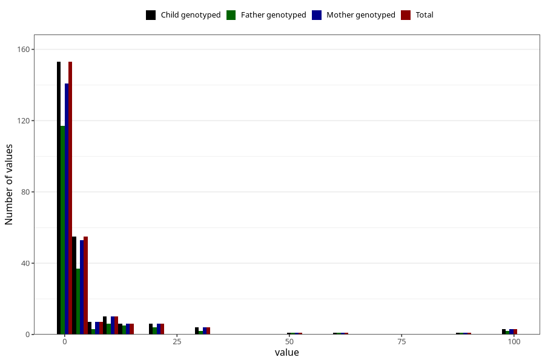

# other_convulsions_with_any_fever_freq_6m
Variable mapping to `DD300` in `Skjema4_6mnd_v12`.
- Number of values:

| Value | Total | Child genotyped | Mother genotyped | Father genotyped |
| ----- | ----- | --------------- | ---------------- | ---------------- |
| Missing | 75061 | 75061 | 71417 | 49905 |
| Non-missing | 247 | 247 | 233 | 179 |
| 25th percentile | 0 | 0 | 0 | 0 |
| 50th percentile | 1 | 1 | 1 | 1 |
| 75th percentile | 3 | 3 | 3 | 3 |
| Mean | 4.86234817813765 | 4.86234817813765 | 5.09871244635193 | 4.75977653631285 |
| Standard deviation | 13.8066379460828 | 13.8066379460828 | 14.1809016805347 | 14.0797628281906 |
| N | 247 | 247 | 233 | 179 |

