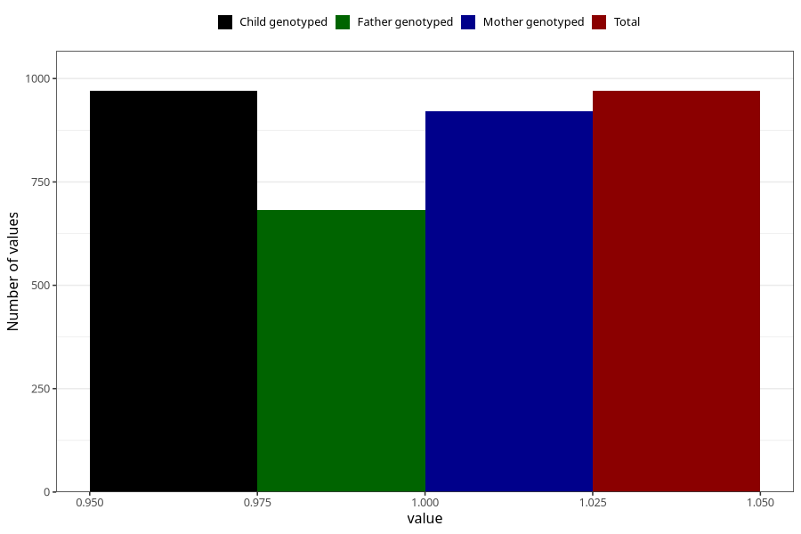

# other_eczema_previous_3y
Variable mapping to `GG83` in `Skjema6_3aar_v12`.
- Number of values:

| Value | Total | Child genotyped | Mother genotyped | Father genotyped |
| ----- | ----- | --------------- | ---------------- | ---------------- |
| Missing | 74338 | 74338 | 70729 | 49401 |
| Non-missing | 970 | 970 | 921 | 683 |
| 1 | 970 | 970 | 921 | 683 |

