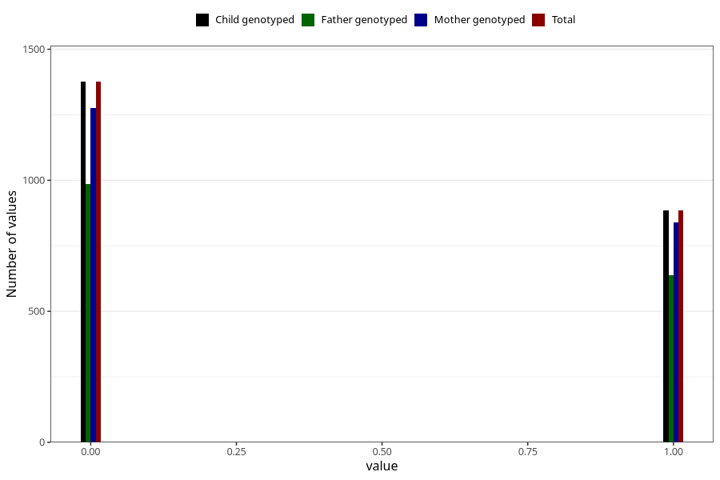

# other_gastrointestinal_problems_2_yes_3y
Variable mapping to `GG575` in `Skjema6_3aar_v12`.
- Number of values:

| Value | Total | Child genotyped | Mother genotyped | Father genotyped |
| ----- | ----- | --------------- | ---------------- | ---------------- |
| Missing | 73046 | 73046 | 69534 | 48458 |
| Non-missing | 2262 | 2262 | 2116 | 1626 |
| 0 | 1376 | 1376 | 1277 | 987 |
| 1 | 886 | 886 | 839 | 639 |

