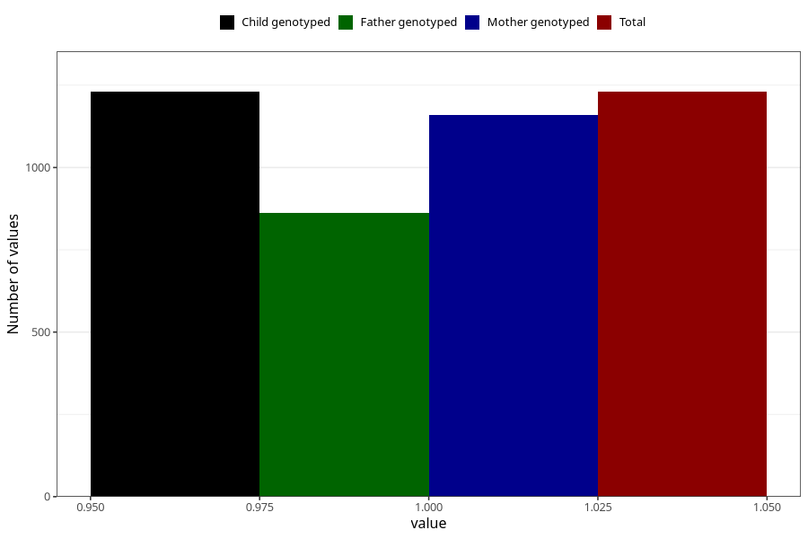

# other_longterm_illness_condition_yes_3y
Variable mapping to `GG114` in `Skjema6_3aar_v12`.
- Number of values:

| Value | Total | Child genotyped | Mother genotyped | Father genotyped |
| ----- | ----- | --------------- | ---------------- | ---------------- |
| Missing | 74078 | 74078 | 70491 | 49221 |
| Non-missing | 1230 | 1230 | 1159 | 863 |
| 1 | 1230 | 1230 | 1159 | 863 |

