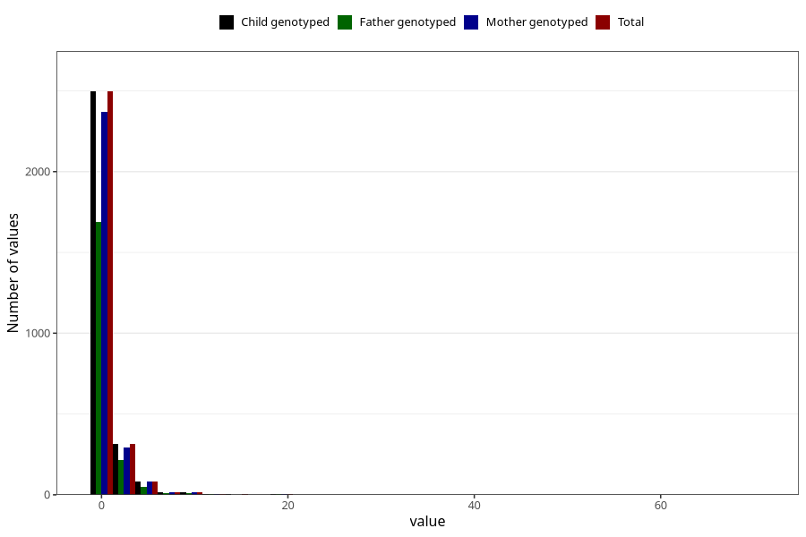

# other_number_12_18m
Variable mapping to `EE273` in `Skjema5_18mnd_v12`.
- Number of values:

| Value | Total | Child genotyped | Mother genotyped | Father genotyped |
| ----- | ----- | --------------- | ---------------- | ---------------- |
| Missing | 72357 | 72357 | 68849 | 48094 |
| Non-missing | 2951 | 2951 | 2801 | 1990 |
| Filled in text or mark instead of number | 4 | 4 | 4 |4 |
| 25th percentile | 1 | 1 | 1 | 1 |
| 50th percentile | 1 | 1 | 1 | 1 |
| 75th percentile | 1 | 1 | 1 | 1 |
| Mean | 1.42042755344418 | 1.42042755344418 | 1.42080800858062 | 1.40030211480363 |
| Standard deviation | 2.37734343322225 | 2.37734343322225 | 2.40972257038065 | 2.16879167727358 |
| N | 2947 | 2947 | 2797 | 1986 |

