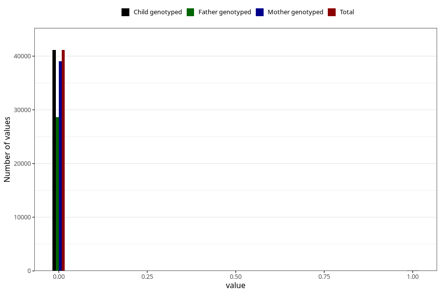

# overweight_3y
Variable created during phenotype curation.
- Number of values:

| Value | Total | Child genotyped | Mother genotyped | Father genotyped |
| ----- | ----- | --------------- | ---------------- | ---------------- |
| Missing | 34069 | 34069 | 32467 | 21336 |
| Non-missing | 41239 | 41239 | 39183 | 28748 |
| 0 | 41131 | 41131 | 39079 | 28669 |
| 1 | 108 | 108 | 104 | 79 |

