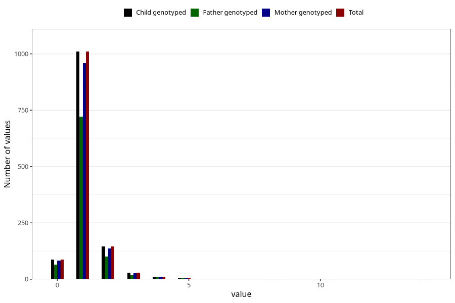

# pseudocroup_freq_6m
Variable mapping to `DD276` in `Skjema4_6mnd_v12`.
- Number of values:

| Value | Total | Child genotyped | Mother genotyped | Father genotyped |
| ----- | ----- | --------------- | ---------------- | ---------------- |
| Missing | 74014 | 74014 | 70425 | 49166 |
| Non-missing | 1294 | 1294 | 1225 | 918 |
| 0 | 88 | 88 | 82 | 65 |
| 1 | 1010 | 1010 | 959 | 721 |
| 2 | 146 | 146 | 137 | 100 |
| 3 | 29 | 29 | 26 | 18 |
| 4 | 12 | 12 | 12 | 9 |
| 5 | 4 | 4 | 4 | 4 |
| 8 | 1 | 1 | 1 | 0 |
| 10 | 3 | 3 | 3 | 1 |
| 14 | 1 | 1 | 1 | 0 |

