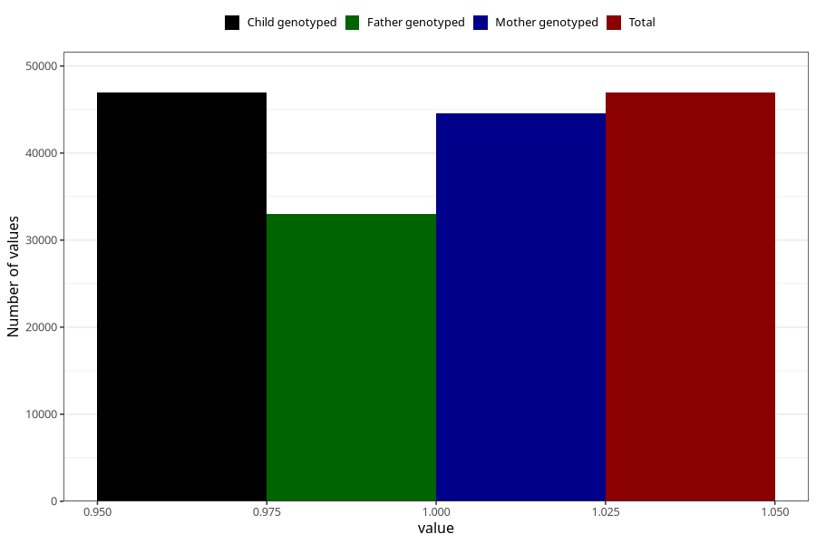

# sleep_problems_no_18m
Variable mapping to `EE843` in `Skjema5_18mnd_v12`.
- Number of values:

| Value | Total | Child genotyped | Mother genotyped | Father genotyped |
| ----- | ----- | --------------- | ---------------- | ---------------- |
| Missing | 28367 | 28367 | 27037 | 17130 |
| Non-missing | 46941 | 46941 | 44613 | 32954 |
| 1 | 46941 | 46941 | 44613 | 32954 |

