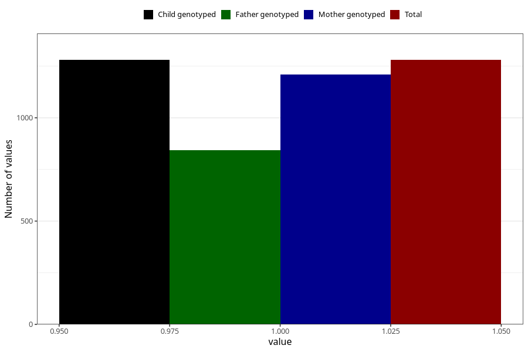

# sleep_problems_previous_3y
Variable mapping to `GG99` in `Skjema6_3aar_v12`.
- Number of values:

| Value | Total | Child genotyped | Mother genotyped | Father genotyped |
| ----- | ----- | --------------- | ---------------- | ---------------- |
| Missing | 74028 | 74028 | 70441 | 49242 |
| Non-missing | 1280 | 1280 | 1209 | 842 |
| 1 | 1280 | 1280 | 1209 | 842 |

