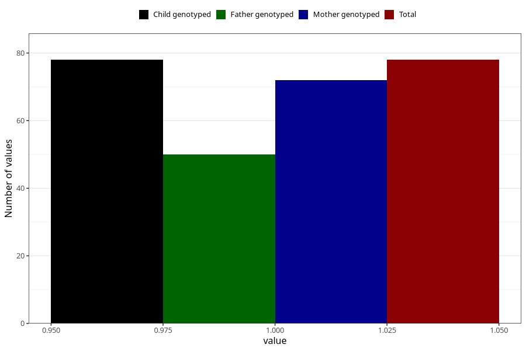

# syndrome_6m
Variable mapping to `DD1110` in `Skjema4_6mnd_v12`.
- Number of values:

| Value | Total | Child genotyped | Mother genotyped | Father genotyped |
| ----- | ----- | --------------- | ---------------- | ---------------- |
| Missing | 75230 | 75230 | 71578 | 50034 |
| Non-missing | 78 | 78 | 72 | 50 |
| 1 | 78 | 78 | 72 | 50 |

