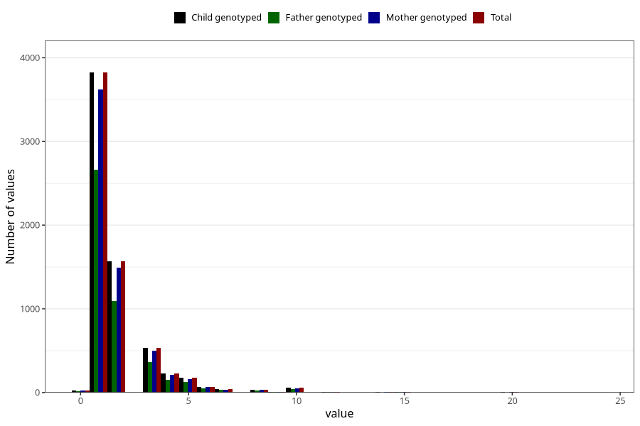

# throat_infection_other_freq_3y
Variable mapping to `GG135` in `Skjema6_3aar_v12`.
- Number of values:

| Value | Total | Child genotyped | Mother genotyped | Father genotyped |
| ----- | ----- | --------------- | ---------------- | ---------------- |
| Missing | 68720 | 68720 | 65411 | 45496 |
| Non-missing | 6588 | 6588 | 6239 | 4588 |
| 0 | 24 | 24 | 22 | 14 |
| 1 | 3823 | 3823 | 3624 | 2666 |
| 2 | 1570 | 1570 | 1494 | 1094 |
| 3 | 532 | 532 | 500 | 365 |
| 4 | 225 | 225 | 211 | 153 |
| 5 | 176 | 176 | 164 | 128 |
| 6 | 69 | 69 | 67 | 48 |
| 7 | 38 | 38 | 34 | 31 |
| 8 | 36 | 36 | 35 | 24 |
| 9 | 6 | 6 | 6 | 4 |
| 10 | 55 | 55 | 50 | 42 |
| 11 | 2 | 2 | 2 | 0 |
| 12 | 8 | 8 | 8 | 5 |
| 13 | 1 | 1 | 1 | 1 |
| 14 | 6 | 6 | 5 | 3 |
| 15 | 8 | 8 | 7 | 6 |
| 18 | 1 | 1 | 1 | 0 |
| 20 | 7 | 7 | 7 | 3 |
| 24 | 1 | 1 | 1 | 1 |

