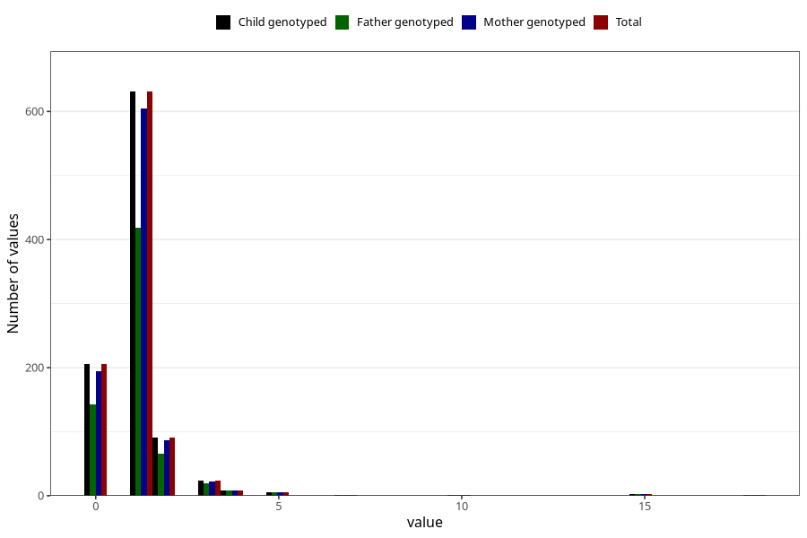

# urinary_tract_infection_number_12_18m
Variable mapping to `EE248` in `Skjema5_18mnd_v12`.
- Number of values:

| Value | Total | Child genotyped | Mother genotyped | Father genotyped |
| ----- | ----- | --------------- | ---------------- | ---------------- |
| Missing | 74337 | 74337 | 70723 | 49420 |
| Non-missing | 971 | 971 | 927 | 664 |
| 0 | 206 | 206 | 195 | 143 |
| 1 | 631 | 631 | 604 | 418 |
| 2 | 91 | 91 | 87 | 65 |
| 3 | 24 | 24 | 22 | 20 |
| 4 | 8 | 8 | 8 | 8 |
| 5 | 6 | 6 | 6 | 5 |
| 7 | 1 | 1 | 1 | 1 |
| 10 | 1 | 1 | 1 | 1 |
| 15 | 2 | 2 | 2 | 2 |
| 18 | 1 | 1 | 1 | 1 |

