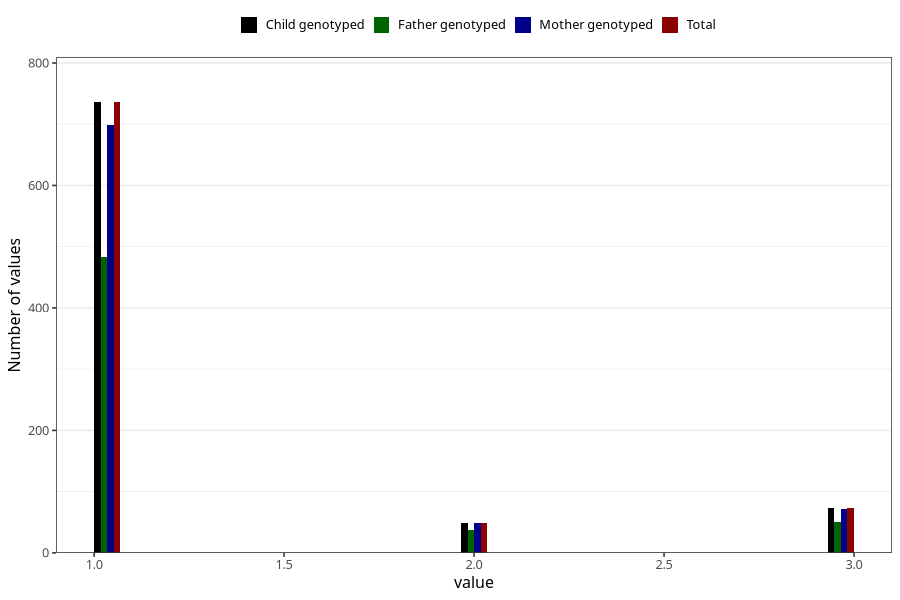

# vaccine_bcg_freq_18m
Variable mapping to `EE166` in `Skjema5_18mnd_v12`.
- Number of values:

| Value | Total | Child genotyped | Mother genotyped | Father genotyped |
| ----- | ----- | --------------- | ---------------- | ---------------- |
| Missing | 74451 | 74451 | 70832 | 49514 |
| Non-missing | 857 | 857 | 818 | 570 |
| 1 | 736 | 736 | 699 | 483 |
| 2 | 48 | 48 | 48 | 37 |
| 3 | 73 | 73 | 71 | 50 |

