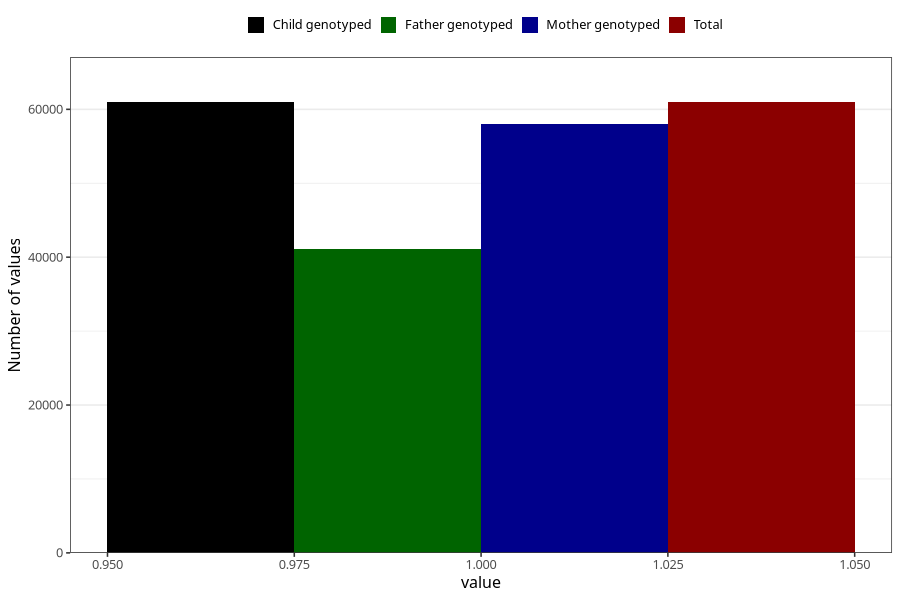

# breastmilk_2m
Variable mapping to `DD51` in `Skjema4_6mnd_v12`.
- Number of values:

| Value | Total | Child genotyped | Mother genotyped | Father genotyped |
| ----- | ----- | --------------- | ---------------- | ---------------- |
| Missing | 14343 | 14343 | 13605 | 9013 |
| Non-missing | 60965 | 60965 | 58045 | 41071 |
| 1 | 60965 | 60965 | 58045 | 41071 |

