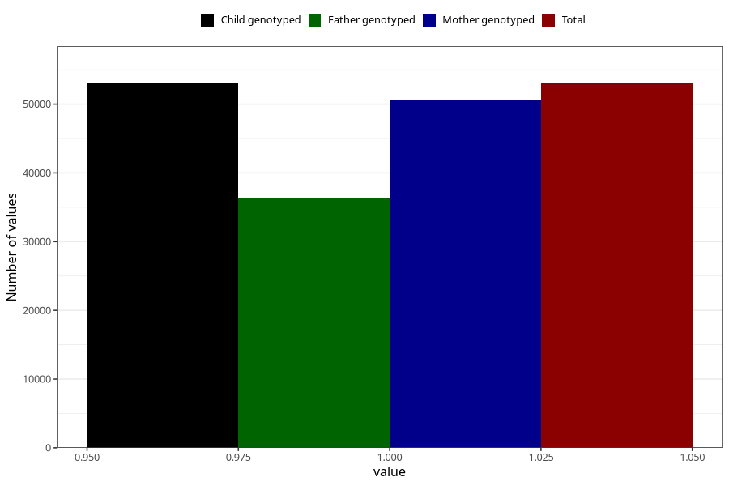

# breastmilk_6m
Variable mapping to `DD55` in `Skjema4_6mnd_v12`.
- Number of values:

| Value | Total | Child genotyped | Mother genotyped | Father genotyped |
| ----- | ----- | --------------- | ---------------- | ---------------- |
| Missing | 22198 | 22198 | 21081 | 13848 |
| Non-missing | 53110 | 53110 | 50569 | 36236 |
| 1 | 53110 | 53110 | 50569 | 36236 |

