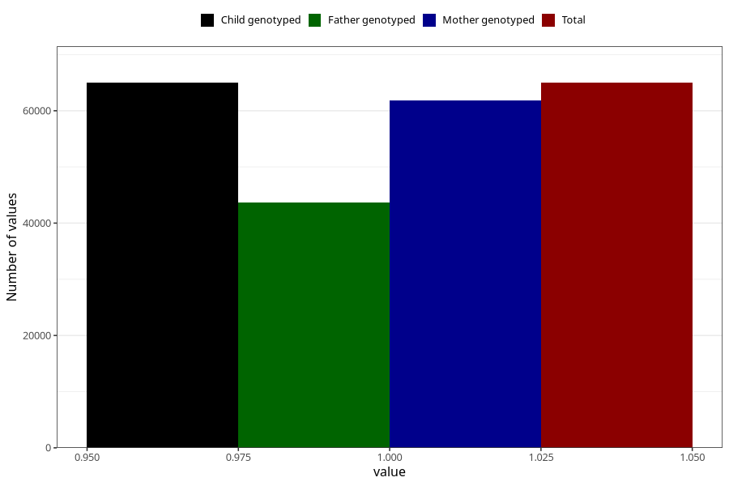

# breastmilk_first_week
Variable mapping to `DD42` in `Skjema4_6mnd_v12`.
- Number of values:

| Value | Total | Child genotyped | Mother genotyped | Father genotyped |
| ----- | ----- | --------------- | ---------------- | ---------------- |
| Missing | 10329 | 10329 | 9783 | 6398 |
| Non-missing | 64979 | 64979 | 61867 | 43686 |
| 1 | 64979 | 64979 | 61867 | 43686 |

