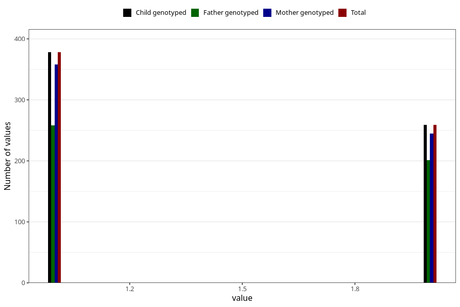

# fish_oil_capsules_amount_per_time_7y
Variable mapping to `JJ536` in `Skjema7aar_v12`.
Variable mapping to `JJ536` in `Skjema7aar_v12`.
- Number of values:

| Value | Total | Child genotyped | Mother genotyped | Father genotyped |
| ----- | ----- | --------------- | ---------------- | ---------------- |
| Missing | 74663 | 74663 | 71040 | 49619 |
| Non-missing | 645 | 645 | 610 | 465 |
| 3+ at a time | 8 | 8 | 7 |6 |
| 1 | 378 | 378 | 358 | 258 |
| 2 | 259 | 259 | 245 | 201 |

