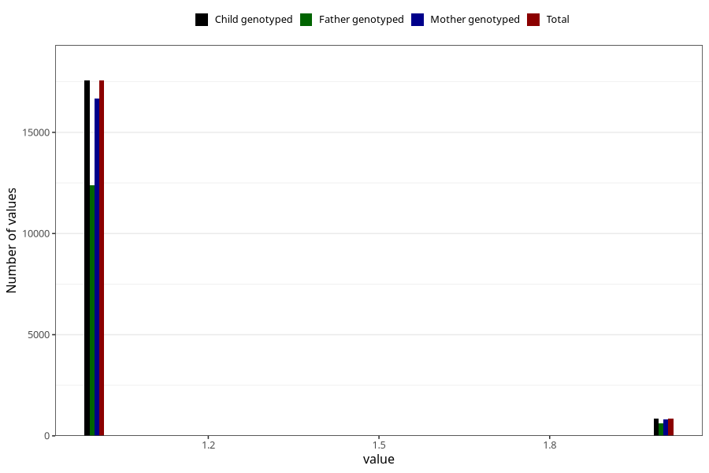

# fluoride_capsules_amount_per_time_7y
Variable mapping to `JJ540` in `Skjema7aar_v12`.
Variable mapping to `JJ540` in `Skjema7aar_v12`.
- Number of values:

| Value | Total | Child genotyped | Mother genotyped | Father genotyped |
| ----- | ----- | --------------- | ---------------- | ---------------- |
| Missing | 56871 | 56871 | 54146 | 37067 |
| Non-missing | 18437 | 18437 | 17504 | 13017 |
| 3+ at a time | 17 | 17 | 14 |14 |
| More than 1 check box filled in | 5 | 5 | 4 |4 |
| 1 | 17559 | 17559 | 16683 | 12400 |
| 2 | 856 | 856 | 803 | 599 |

