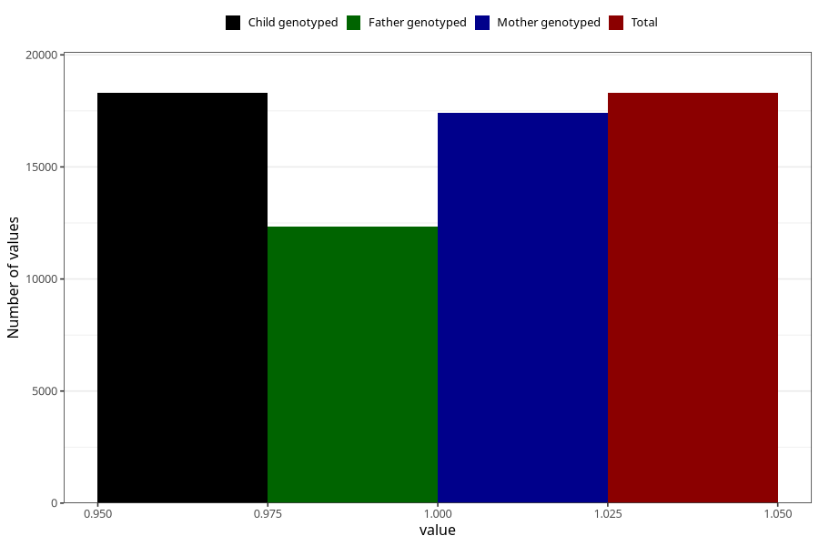

# formula_6_8m
Variable mapping to `EE16` in `Skjema5_18mnd_v12`.
- Number of values:

| Value | Total | Child genotyped | Mother genotyped | Father genotyped |
| ----- | ----- | --------------- | ---------------- | ---------------- |
| Missing | 57009 | 57009 | 54248 | 37743 |
| Non-missing | 18299 | 18299 | 17402 | 12341 |
| 1 | 18299 | 18299 | 17402 | 12341 |

