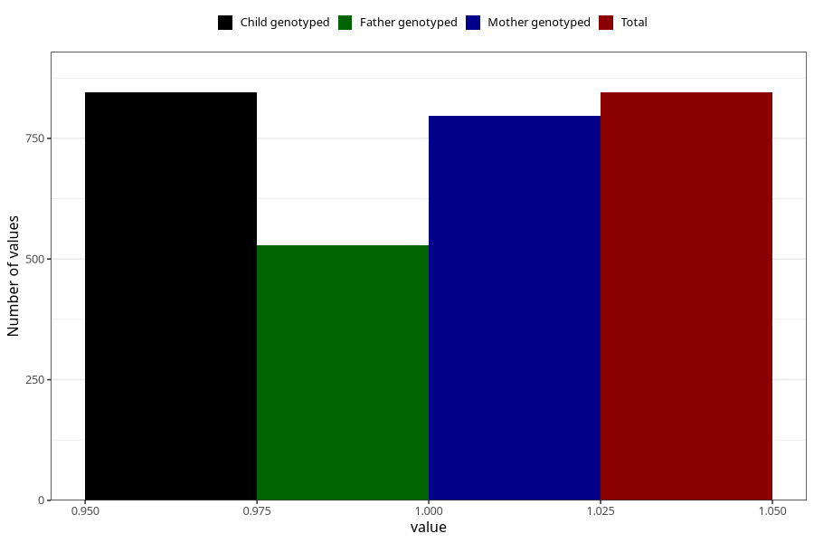

# formula_colett_5m
Variable mapping to `DD61` in `Skjema4_6mnd_v12`.
- Number of values:

| Value | Total | Child genotyped | Mother genotyped | Father genotyped |
| ----- | ----- | --------------- | ---------------- | ---------------- |
| Missing | 74463 | 74463 | 70854 | 49555 |
| Non-missing | 845 | 845 | 796 | 529 |
| 1 | 845 | 845 | 796 | 529 |

