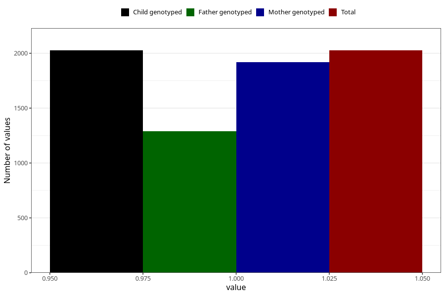

# formula_colett_omega3_2m
Variable mapping to `DD65` in `Skjema4_6mnd_v12`.
- Number of values:

| Value | Total | Child genotyped | Mother genotyped | Father genotyped |
| ----- | ----- | --------------- | ---------------- | ---------------- |
| Missing | 73282 | 73282 | 69730 | 48795 |
| Non-missing | 2026 | 2026 | 1920 | 1289 |
| 1 | 2026 | 2026 | 1920 | 1289 |

