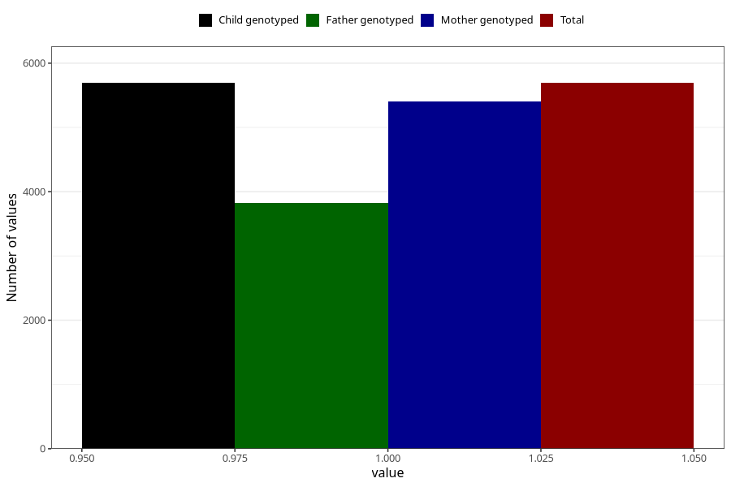

# formula_nan_1m
Variable mapping to `DD71` in `Skjema4_6mnd_v12`.
- Number of values:

| Value | Total | Child genotyped | Mother genotyped | Father genotyped |
| ----- | ----- | --------------- | ---------------- | ---------------- |
| Missing | 69616 | 69616 | 66248 | 46259 |
| Non-missing | 5692 | 5692 | 5402 | 3825 |
| 1 | 5692 | 5692 | 5402 | 3825 |

