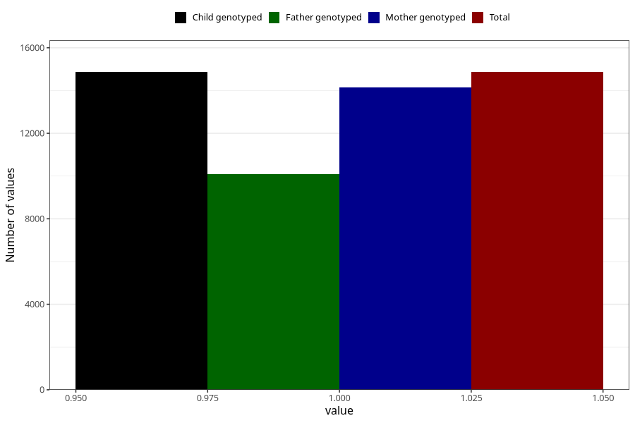

# formula_nan_5m
Variable mapping to `DD75` in `Skjema4_6mnd_v12`.
- Number of values:

| Value | Total | Child genotyped | Mother genotyped | Father genotyped |
| ----- | ----- | --------------- | ---------------- | ---------------- |
| Missing | 60443 | 60443 | 57501 | 39984 |
| Non-missing | 14865 | 14865 | 14149 | 10100 |
| 1 | 14865 | 14865 | 14149 | 10100 |

