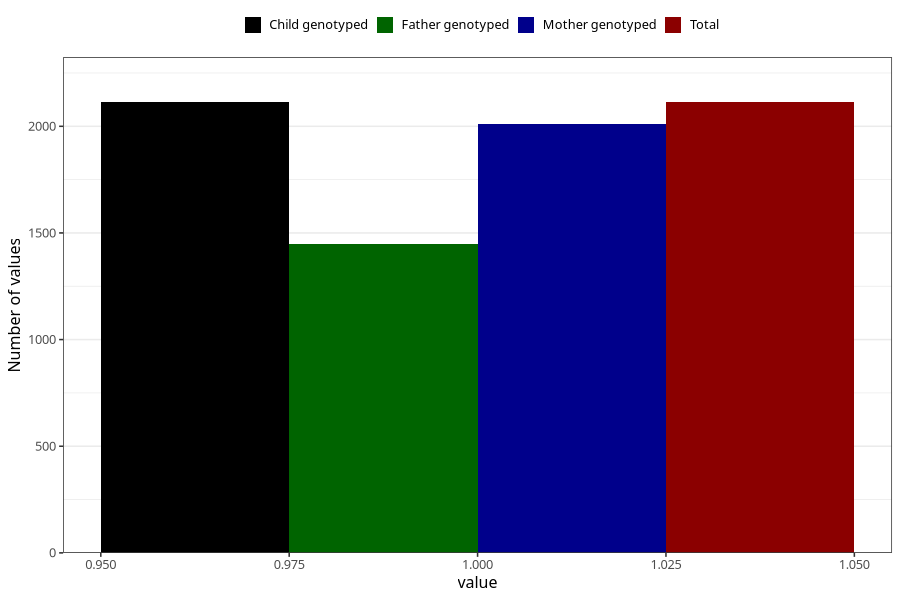

# formula_nan_ha1_3m
Variable mapping to `DD80` in `Skjema4_6mnd_v12`.
- Number of values:

| Value | Total | Child genotyped | Mother genotyped | Father genotyped |
| ----- | ----- | --------------- | ---------------- | ---------------- |
| Missing | 73195 | 73195 | 69640 | 48635 |
| Non-missing | 2113 | 2113 | 2010 | 1449 |
| 1 | 2113 | 2113 | 2010 | 1449 |

