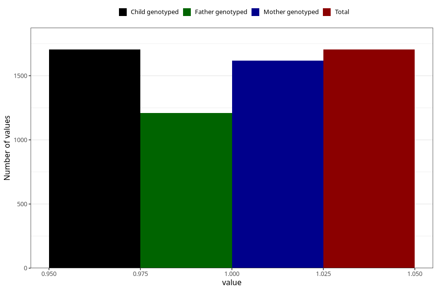

# formula_nan_ha1_6m
Variable mapping to `DD83` in `Skjema4_6mnd_v12`.
- Number of values:

| Value | Total | Child genotyped | Mother genotyped | Father genotyped |
| ----- | ----- | --------------- | ---------------- | ---------------- |
| Missing | 73604 | 73604 | 70033 | 48873 |
| Non-missing | 1704 | 1704 | 1617 | 1211 |
| 1 | 1704 | 1704 | 1617 | 1211 |

