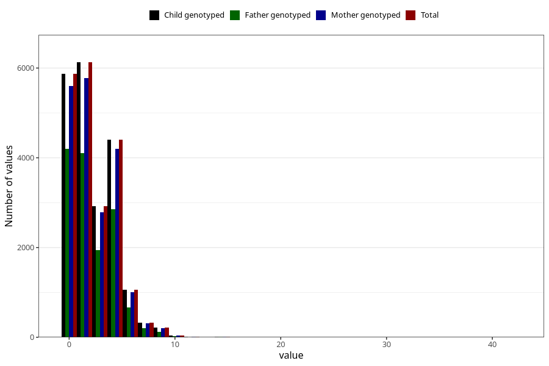

# n_slices_medium_refined_bread_daily_7y
Variable mapping to `JJ340` in `Skjema7aar_v12`.
- Number of values:

| Value | Total | Child genotyped | Mother genotyped | Father genotyped |
| ----- | ----- | --------------- | ---------------- | ---------------- |
| Missing | 54331 | 54331 | 51723 | 35950 |
| Non-missing | 20977 | 20977 | 19927 | 14134 |
| 25th percentile | 0 | 0 | 0 | 0 |
| 50th percentile | 2 | 2 | 2 | 2 |
| 75th percentile | 4 | 4 | 4 | 4 |
| Mean | 2.33508127949659 | 2.33508127949659 | 2.33627741255583 | 2.24897410499505 |
| Standard deviation | 2.09697342931069 | 2.09697342931069 | 2.0974167764944 | 2.07328514547669 |
| N | 20977 | 20977 | 19927 | 14134 |

