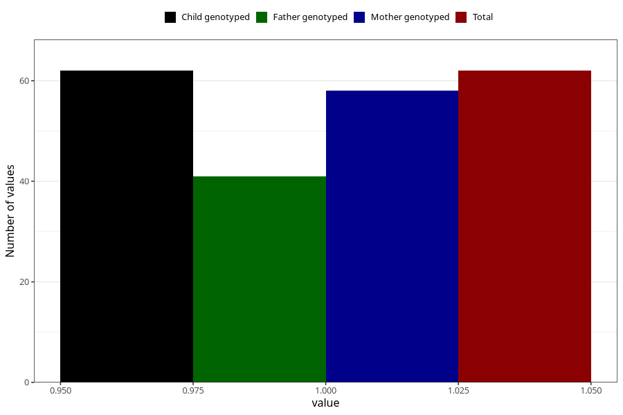

# rheumatoid_arthritis_7y
Variable mapping to `JJ427` in `Skjema7aar_v12`.
Variable mapping to `JJ427` in `Skjema7aar_v12`.
Variable mapping to `JJ427` in `Skjema7aar_v12`.
- Number of values:

| Value | Total | Child genotyped | Mother genotyped | Father genotyped |
| ----- | ----- | --------------- | ---------------- | ---------------- |
| Missing | 75246 | 75246 | 71592 | 50043 |
| Non-missing | 62 | 62 | 58 | 41 |
| 1 | 62 | 62 | 58 | 41 |

