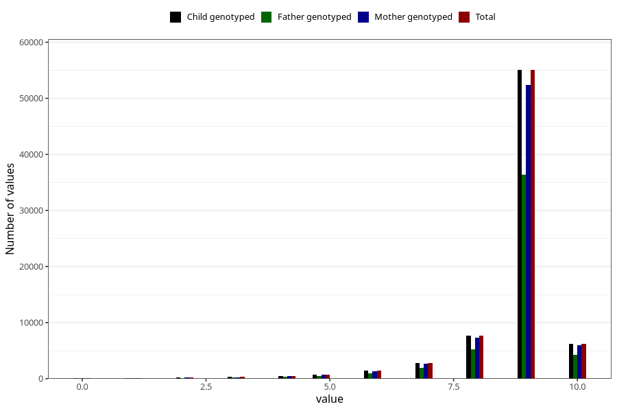

# apgar_1
Variable mapping to `APGAR1` in `MFR_541_v12`.
- Number of values:

| Value | Total | Child genotyped | Mother genotyped | Father genotyped |
| ----- | ----- | --------------- | ---------------- | ---------------- |
| Missing | 145 | 145 | 137 | 85 |
| Non-missing | 75163 | 75163 | 71513 | 49999 |
| 0 | 87 | 87 | 83 | 56 |
| 1 | 123 | 123 | 114 | 78 |
| 2 | 220 | 220 | 210 | 162 |
| 3 | 291 | 291 | 278 | 213 |
| 4 | 477 | 477 | 459 | 315 |
| 5 | 750 | 750 | 720 | 514 |
| 6 | 1430 | 1430 | 1345 | 934 |
| 7 | 2786 | 2786 | 2650 | 1923 |
| 8 | 7683 | 7683 | 7308 | 5187 |
| 9 | 55045 | 55045 | 52410 | 36344 |
| 10 | 6271 | 6271 | 5936 | 4273 |

