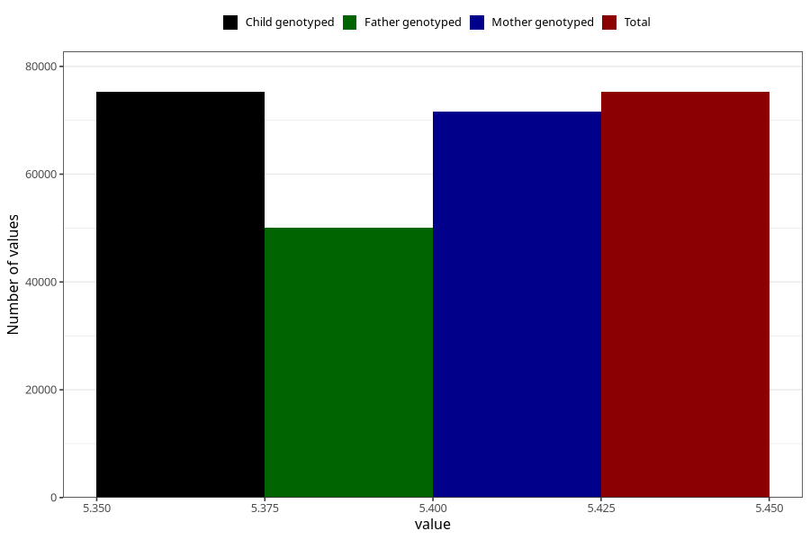

# mfr_record_version
Variable mapping to `VERSJON_RECORD` in `MFR_541_v12`.
- Number of values:

| Value | Total | Child genotyped | Mother genotyped | Father genotyped |
| ----- | ----- | --------------- | ---------------- | ---------------- |
| Missing | 61 | 61 | 57 | 40 |
| Non-missing | 75247 | 75247 | 71593 | 50044 |
| 5.41 | 75247 | 75247 | 71593 | 50044 |

