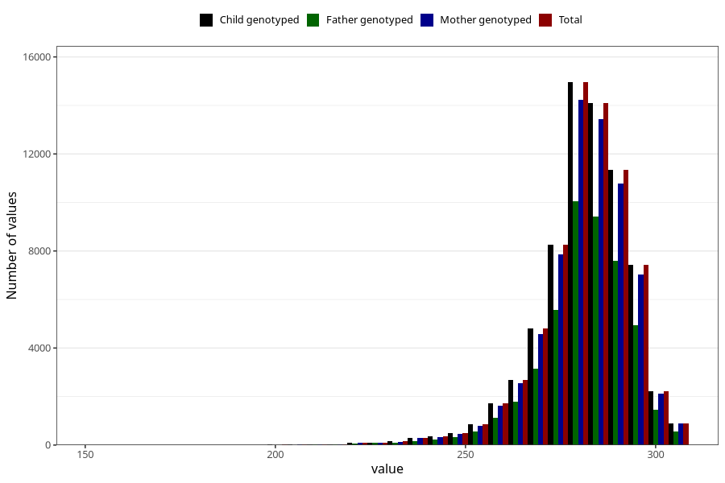

# pregnancy_duration_mens
Variable mapping to `SVLEN_SM_DG` in `MFR_541_v12`.
- Number of values:

| Value | Total | Child genotyped | Mother genotyped | Father genotyped |
| ----- | ----- | --------------- | ---------------- | ---------------- |
| Missing | 4409 | 4409 | 4164 | 2837 |
| Non-missing | 70899 | 70899 | 67486 | 47247 |
| 25th percentile | 275 | 275 | 275 | 275 |
| 50th percentile | 283 | 283 | 283 | 283 |
| 75th percentile | 289 | 289 | 289 | 289 |
| Mean | 281.233769164586 | 281.233769164586 | 281.237086210473 | 281.259466209495 |
| Standard deviation | 12.3809707066145 | 12.3809707066145 | 12.3846160851192 | 12.2770928014931 |
| N | 70899 | 70899 | 67486 | 47247 |

