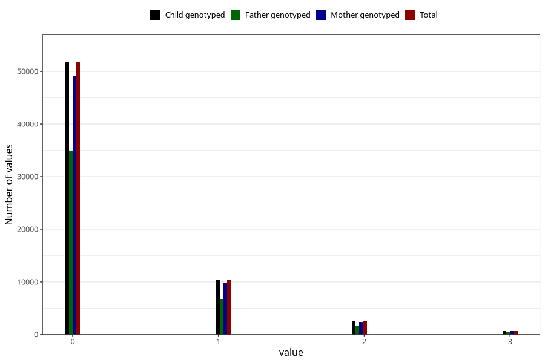

# previous_miscarriages_before_12w
Variable mapping to `SPABORT_12_5` in `MFR_541_v12`.
- Number of values:

| Value | Total | Child genotyped | Mother genotyped | Father genotyped |
| ----- | ----- | --------------- | ---------------- | ---------------- |
| Missing | 9612 | 9612 | 9208 | 6223 |
| Non-missing | 65696 | 65696 | 62442 | 43861 |
| 4 or more | 359 | 359 | 332 |215 |
| 0 | 51831 | 51831 | 49243 | 34962 |
| 1 | 10359 | 10359 | 9872 | 6717 |
| 2 | 2488 | 2488 | 2366 | 1570 |
| 3 | 659 | 659 | 629 | 397 |

