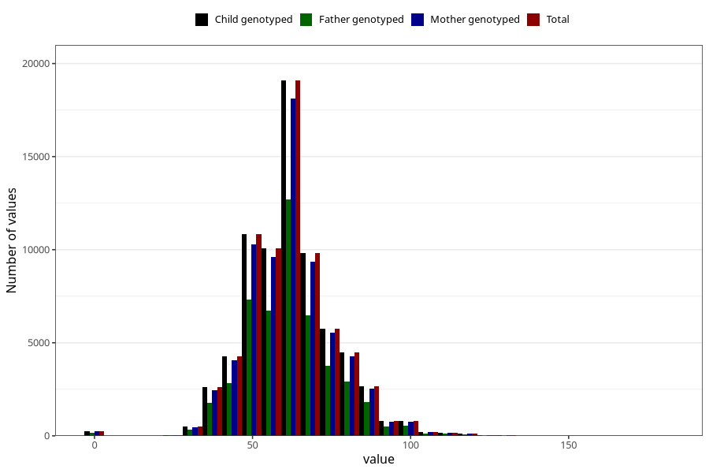

# umbilical_cord_length
Variable mapping to `NAVLESNORLENGDE` in `MFR_541_v12`.
- Number of values:

| Value | Total | Child genotyped | Mother genotyped | Father genotyped |
| ----- | ----- | --------------- | ---------------- | ---------------- |
| Missing | 2747 | 2747 | 2587 | 1855 |
| Non-missing | 72561 | 72561 | 69063 | 48229 |
| 25th percentile | 52 | 52 | 52 | 52 |
| 50th percentile | 60 | 60 | 60 | 60 |
| 75th percentile | 70 | 70 | 70 | 70 |
| Mean | 62.0261945122035 | 62.0261945122035 | 62.0518323849239 | 61.914495428062 |
| Standard deviation | 14.1291658939983 | 14.1291658939983 | 14.1206505340241 | 14.1582917027941 |
| N | 72561 | 72561 | 69063 | 48229 |

