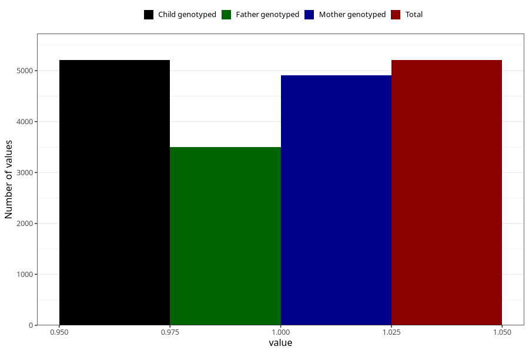

# asthma_before
Variable mapping to `AA419` in `Skjema1_v12`.
- Number of values:

| Value | Total | Child genotyped | Mother genotyped | Father genotyped |
| ----- | ----- | --------------- | ---------------- | ---------------- |
| Missing | 70101 | 70101 | 66740 | 46587 |
| Non-missing | 5207 | 5207 | 4910 | 3497 |
| 1 | 5207 | 5207 | 4910 | 3497 |

