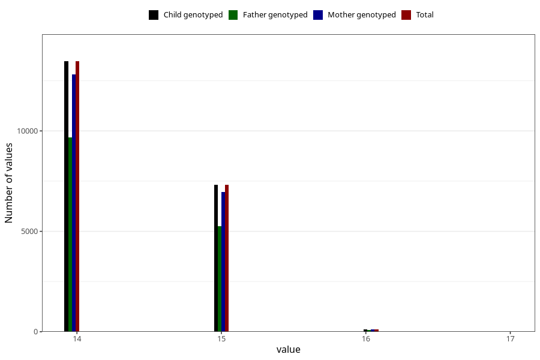

# age_answering_q_14m
Variable mapping to `AGE_YRS_UM` in `Ungdomsskjema_Mor_v12_standard`.
- Number of values:

| Value | Total | Child genotyped | Mother genotyped | Father genotyped |
| ----- | ----- | --------------- | ---------------- | ---------------- |
| Missing | 54388 | 54388 | 51750 | 35066 |
| Non-missing | 20920 | 20920 | 19900 | 15018 |
| 14 | 13467 | 13467 | 12811 | 9678 |
| 15 | 7323 | 7323 | 6967 | 5251 |
| 16 | 128 | 128 | 120 | 87 |
| 17 | 2 | 2 | 2 | 2 |

