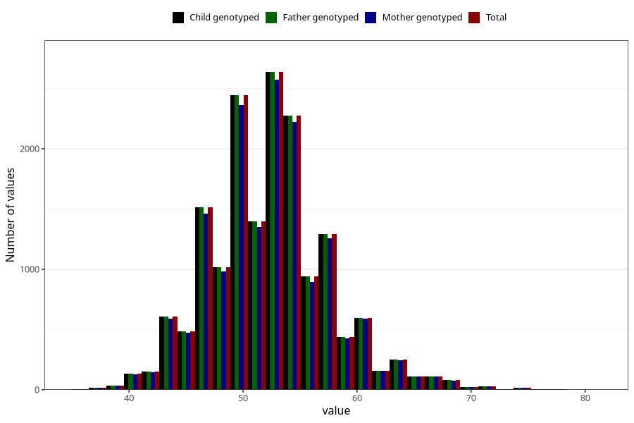

# age_answering_q_hf
Variable mapping to `AGE_YRS_HF` in `HelseFedre`.
- Number of values:

| Value | Total | Child genotyped | Mother genotyped | Father genotyped |
| ----- | ----- | --------------- | ---------------- | ---------------- |
| Missing | 58529 | 58529 | 55363 | 33305 |
| Non-missing | 16779 | 16779 | 16287 | 16779 |
| 25th percentile | 49 | 49 | 49 | 49 |
| 50th percentile | 52 | 52 | 52 | 52 |
| 75th percentile | 55 | 55 | 55 | 55 |
| Mean | 52.243757077299 | 52.243757077299 | 52.2587339595997 | 52.243757077299 |
| Standard deviation | 5.27336534115818 | 5.27336534115818 | 5.28408071196325 | 5.27336534115818 |
| N | 16779 | 16779 | 16287 | 16779 |

