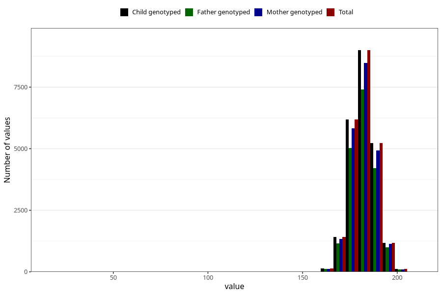

# father_height_self_15w
Variable mapping to `FF333` in `SkjemaFar_v12`.
- Number of values:

| Value | Total | Child genotyped | Mother genotyped | Father genotyped |
| ----- | ----- | --------------- | ---------------- | ---------------- |
| Missing | 52053 | 52053 | 49694 | 31091 |
| Non-missing | 23255 | 23255 | 21956 | 18993 |
| 25th percentile | 178 | 178 | 178 | 178 |
| 50th percentile | 182 | 182 | 182 | 182 |
| 75th percentile | 186 | 186 | 186 | 186 |
| Mean | 181.931498602451 | 181.931498602451 | 181.941838221898 | 181.947559627231 |
| Standard deviation | 6.68387621896692 | 6.68387621896692 | 6.70831843357947 | 6.70238427736819 |
| N | 23255 | 23255 | 21956 | 18993 |

