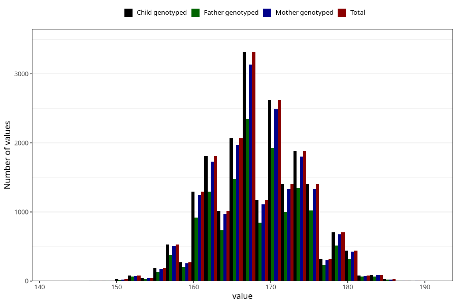

# height_mother_14m
Variable mapping to `UM271` in `Ungdomsskjema_Mor_v12_standard`.
- Number of values:

| Value | Total | Child genotyped | Mother genotyped | Father genotyped |
| ----- | ----- | --------------- | ---------------- | ---------------- |
| Missing | 54488 | 54488 | 51848 | 35135 |
| Non-missing | 20820 | 20820 | 19802 | 14949 |
| 25th percentile | 164 | 164 | 164 | 164 |
| 50th percentile | 168 | 168 | 168 | 168 |
| 75th percentile | 172 | 172 | 172 | 172 |
| Mean | 168.402401536984 | 168.402401536984 | 168.401171598828 | 168.456485383638 |
| Standard deviation | 5.78654142564803 | 5.78654142564803 | 5.79678372212386 | 5.78409684167602 |
| N | 20820 | 20820 | 19802 | 14949 |

