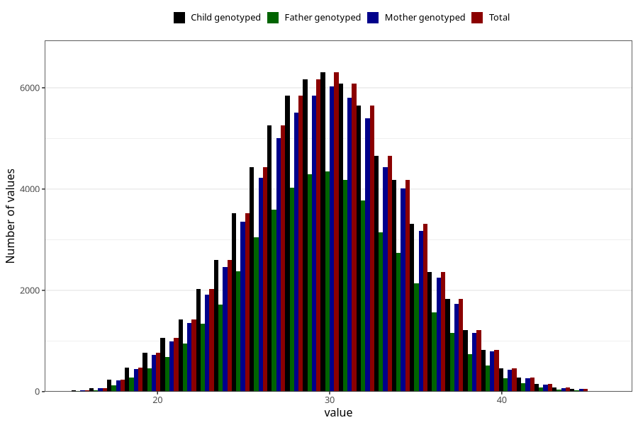

# mother_age_15w
Variable mapping to `MOR_ALDERUTFYLT_S1` in `Skjema1_v12`.
- Number of values:

| Value | Total | Child genotyped | Mother genotyped | Father genotyped |
| ----- | ----- | --------------- | ---------------- | ---------------- |
| Missing | 3988 | 3988 | 3779 | 2262 |
| Non-missing | 71320 | 71320 | 67871 | 47822 |
| 25th percentile | 27 | 27 | 27 | 27 |
| 50th percentile | 30 | 30 | 30 | 30 |
| 75th percentile | 33 | 33 | 33 | 33 |
| Mean | 29.7659562535053 | 29.7659562535053 | 29.7792282418117 | 29.7287650035548 |
| Standard deviation | 4.51453954930868 | 4.51453954930868 | 4.50928017762021 | 4.40370129263795 |
| N | 71320 | 71320 | 67871 | 47822 |

