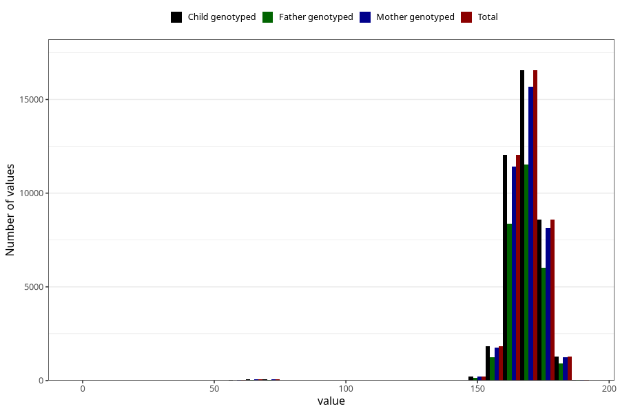

# mother_height_3y
Variable mapping to `GG502` in `Skjema6_3aar_v12`.
- Number of values:

| Value | Total | Child genotyped | Mother genotyped | Father genotyped |
| ----- | ----- | --------------- | ---------------- | ---------------- |
| Missing | 34612 | 34612 | 32991 | 21723 |
| Non-missing | 40696 | 40696 | 38659 | 28361 |
| 25th percentile | 164 | 164 | 164 | 164 |
| 50th percentile | 168 | 168 | 168 | 168 |
| 75th percentile | 172 | 172 | 172 | 172 |
| Mean | 168.065903282878 | 168.065903282878 | 168.041697922864 | 168.100490109658 |
| Standard deviation | 8.71713722055095 | 8.71713722055095 | 8.83777311967452 | 8.65082645877656 |
| N | 40696 | 40696 | 38659 | 28361 |

