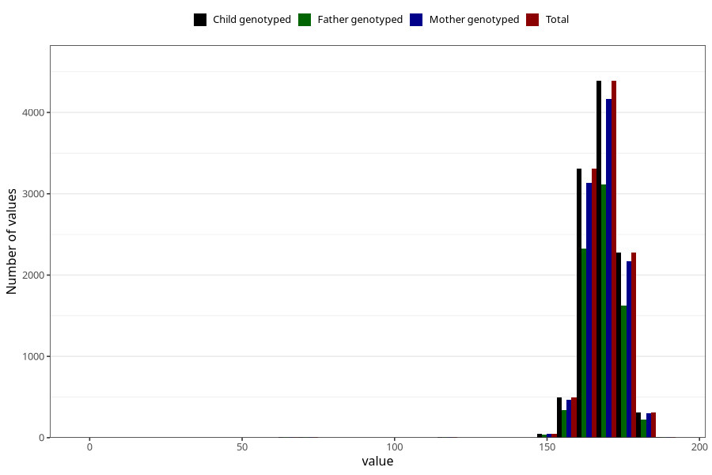

# mother_height_5y
Variable mapping to `LL338` in `Skjema5aar_v12`.
- Number of values:

| Value | Total | Child genotyped | Mother genotyped | Father genotyped |
| ----- | ----- | --------------- | ---------------- | ---------------- |
| Missing | 64449 | 64449 | 61329 | 42381 |
| Non-missing | 10859 | 10859 | 10321 | 7703 |
| 25th percentile | 164 | 164 | 164 | 164 |
| 50th percentile | 168 | 168 | 168 | 168 |
| 75th percentile | 172 | 172 | 172 | 172 |
| Mean | 168.187402154895 | 168.187402154895 | 168.210541614185 | 168.188627807348 |
| Standard deviation | 7.17776568224695 | 7.17776568224695 | 7.1234238911755 | 7.40483573667831 |
| N | 10859 | 10859 | 10321 | 7703 |

