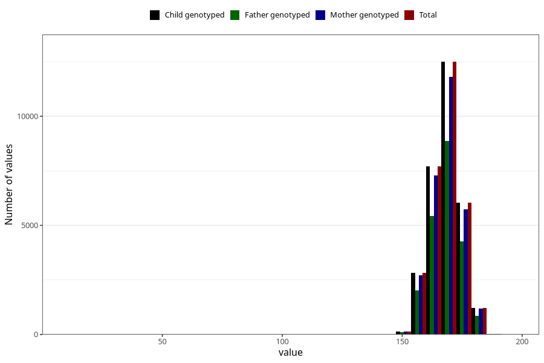

# mother_height_8y
Variable mapping to `NN283` in `Skjema8aar_v12`.
- Number of values:

| Value | Total | Child genotyped | Mother genotyped | Father genotyped |
| ----- | ----- | --------------- | ---------------- | ---------------- |
| Missing | 44793 | 44793 | 42722 | 28495 |
| Non-missing | 30515 | 30515 | 28928 | 21589 |
| 25th percentile | 164 | 164 | 164 | 164 |
| 50th percentile | 168 | 168 | 168 | 168 |
| 75th percentile | 172 | 172 | 172 | 172 |
| Mean | 168.33124692774 | 168.33124692774 | 168.321902654867 | 168.340126916485 |
| Standard deviation | 6.57646638217266 | 6.57646638217266 | 6.62753115428505 | 6.45946099003893 |
| N | 30515 | 30515 | 28928 | 21589 |

