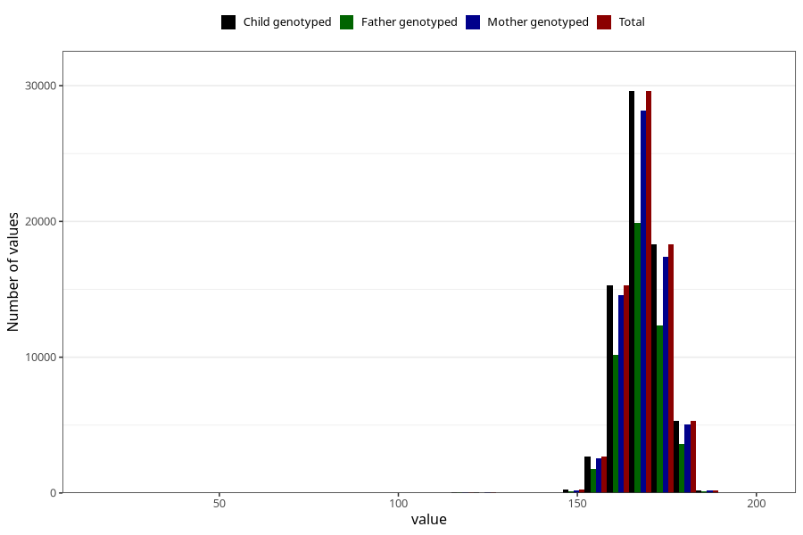

# mother_median_height
Variable created during phenotype curation.
- Number of values:

| Value | Total | Child genotyped | Mother genotyped | Father genotyped |
| ----- | ----- | --------------- | ---------------- | ---------------- |
| Missing | 3522 | 3522 | 3337 | 1917 |
| Non-missing | 71786 | 71786 | 68313 | 48167 |
| 25th percentile | 164 | 164 | 164 | 164 |
| 50th percentile | 168 | 168 | 168 | 168 |
| 75th percentile | 172 | 172 | 172 | 172 |
| Mean | 168.198896720809 | 168.198896720809 | 168.197092793465 | 168.263541428779 |
| Standard deviation | 6.77382921053067 | 6.77382921053067 | 6.76921642419643 | 6.57264211122132 |
| N | 71786 | 71786 | 68313 | 48167 |

