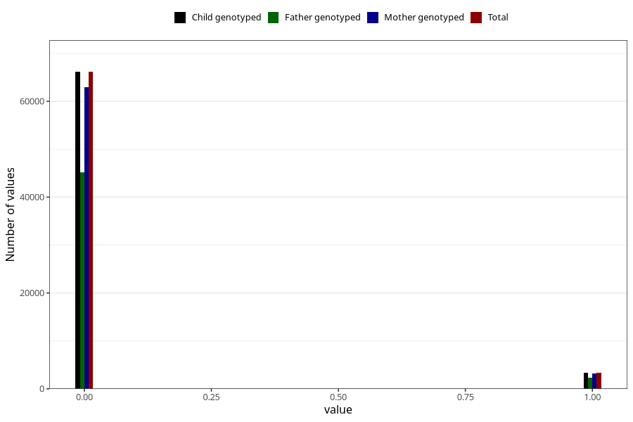

# mother_tongue_morfar
Variable mapping to `AA1311_D` in `Skjema1_v12`.
- Number of values:

| Value | Total | Child genotyped | Mother genotyped | Father genotyped |
| ----- | ----- | --------------- | ---------------- | ---------------- |
| Missing | 5864 | 5864 | 5604 | 2623 |
| Non-missing | 69444 | 69444 | 66046 | 47461 |
| 0 | 66138 | 66138 | 62910 | 45169 |
| 1 | 3306 | 3306 | 3136 | 2292 |

