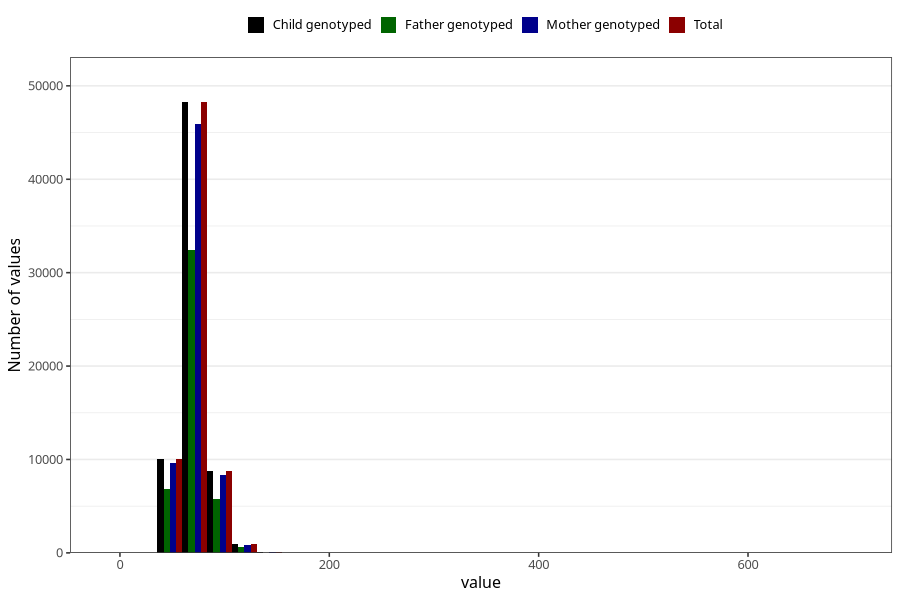

# mother_weight_15w
Variable mapping to `AA86` in `Skjema1_v12`.
- Number of values:

| Value | Total | Child genotyped | Mother genotyped | Father genotyped |
| ----- | ----- | --------------- | ---------------- | ---------------- |
| Missing | 7200 | 7200 | 6844 | 4357 |
| Non-missing | 68108 | 68108 | 64806 | 45727 |
| 25th percentile | 63 | 63 | 63 | 62 |
| 50th percentile | 69 | 69 | 69 | 69 |
| 75th percentile | 77 | 77 | 77 | 77 |
| Mean | 71.0871703764609 | 71.0871703764609 | 71.0709502206586 | 70.9853259562184 |
| Standard deviation | 12.7662864930259 | 12.7662864930259 | 12.7532557833043 | 12.7918641464717 |
| N | 68108 | 68108 | 64806 | 45727 |

