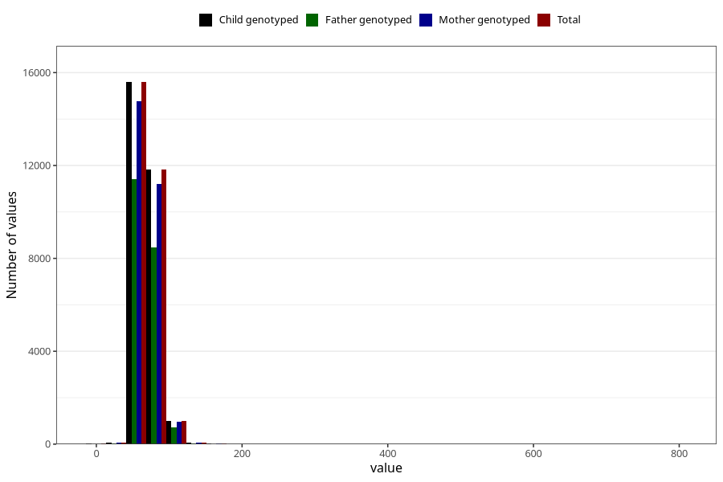

# mother_weight_5y
Variable mapping to `LL339` in `Skjema5aar_v12`.
- Number of values:

| Value | Total | Child genotyped | Mother genotyped | Father genotyped |
| ----- | ----- | --------------- | ---------------- | ---------------- |
| Missing | 46719 | 46719 | 44567 | 29374 |
| Non-missing | 28589 | 28589 | 27083 | 20710 |
| 25th percentile | 61 | 61 | 61 | 61 |
| 50th percentile | 67.3 | 67.3 | 67.2 | 67 |
| 75th percentile | 75.5 | 75.5 | 75.5 | 75 |
| Mean | 69.6749309174858 | 69.6749309174858 | 69.6642727910497 | 69.5719072911637 |
| Standard deviation | 15.5366538350255 | 15.5366538350255 | 15.6500465811604 | 16.2647495855216 |
| N | 28589 | 28589 | 27083 | 20710 |

