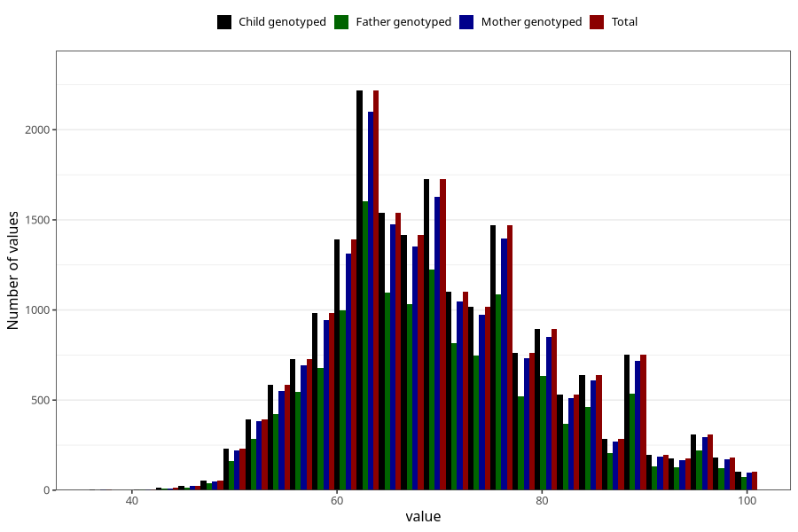

# weight_mother_14m
Variable mapping to `UM272` in `Ungdomsskjema_Mor_v12_standard`.
- Number of values:

| Value | Total | Child genotyped | Mother genotyped | Father genotyped |
| ----- | ----- | --------------- | ---------------- | ---------------- |
| Missing | 55578 | 55578 | 52884 | 35924 |
| Non-missing | 19730 | 19730 | 18766 | 14160 |
| 25th percentile | 62 | 62 | 62 | 62 |
| 50th percentile | 69 | 69 | 69 | 69 |
| 75th percentile | 77 | 77 | 77 | 77 |
| Mean | 70.2246325392803 | 70.2246325392803 | 70.2286582116594 | 70.1697740112994 |
| Standard deviation | 10.9165558244471 | 10.9165558244471 | 10.9209104219922 | 10.85403825441 |
| N | 19730 | 19730 | 18766 | 14160 |

