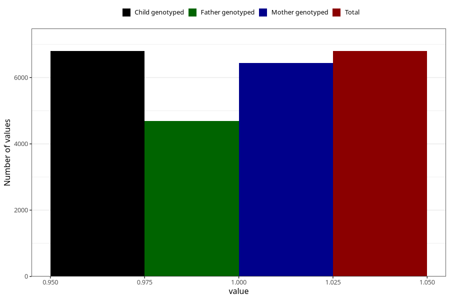

# abdominal_pain_13w_15w
Variable mapping to `AA189` in `Skjema1_v12`.
- Number of values:

| Value | Total | Child genotyped | Mother genotyped | Father genotyped |
| ----- | ----- | --------------- | ---------------- | ---------------- |
| Missing | 68509 | 68509 | 65209 | 45388 |
| Non-missing | 6799 | 6799 | 6441 | 4696 |
| 1 | 6799 | 6799 | 6441 | 4696 |

