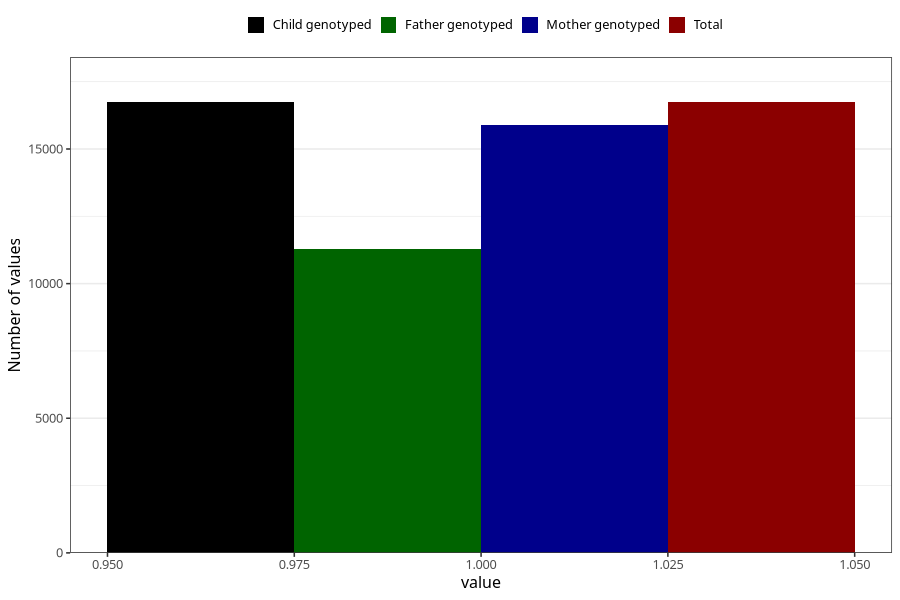

# back_pain_21w_24w
Variable mapping to `CC354` in `Skjema3_v12`.
- Number of values:

| Value | Total | Child genotyped | Mother genotyped | Father genotyped |
| ----- | ----- | --------------- | ---------------- | ---------------- |
| Missing | 58570 | 58570 | 55762 | 38783 |
| Non-missing | 16738 | 16738 | 15888 | 11301 |
| 1 | 16738 | 16738 | 15888 | 11301 |

