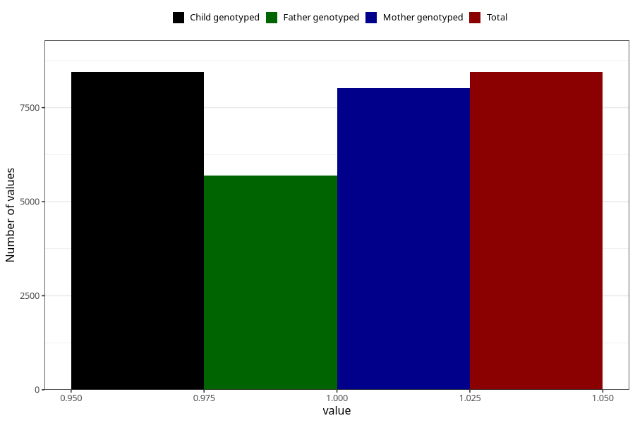

# back_pain_9w_12w
Variable mapping to `AA198` in `Skjema1_v12`.
- Number of values:

| Value | Total | Child genotyped | Mother genotyped | Father genotyped |
| ----- | ----- | --------------- | ---------------- | ---------------- |
| Missing | 66863 | 66863 | 63630 | 44392 |
| Non-missing | 8445 | 8445 | 8020 | 5692 |
| 1 | 8445 | 8445 | 8020 | 5692 |

