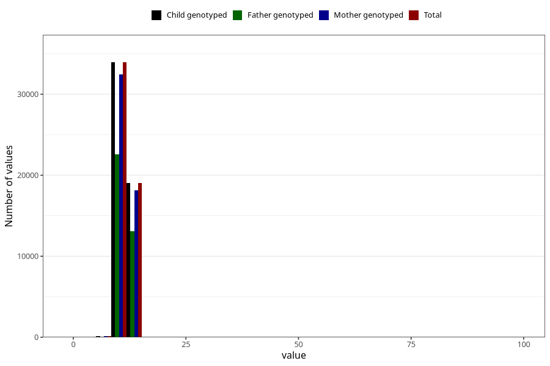

# blood_haemoglobin_lowest_30w
Variable mapping to `CC128` in `Skjema3_v12`.
- Number of values:

| Value | Total | Child genotyped | Mother genotyped | Father genotyped |
| ----- | ----- | --------------- | ---------------- | ---------------- |
| Missing | 22065 | 22065 | 20833 | 14246 |
| Non-missing | 53243 | 53243 | 50817 | 35838 |
| 25th percentile | 10.9 | 10.9 | 10.9 | 10.9 |
| 50th percentile | 11.5 | 11.5 | 11.5 | 11.5 |
| 75th percentile | 12.1 | 12.1 | 12.1 | 12.2 |
| Mean | 11.5474353436132 | 11.5474353436132 | 11.5476336658992 | 11.5544143088342 |
| Standard deviation | 2.2013035966932 | 2.2013035966932 | 2.22205160633985 | 1.95897893761193 |
| N | 53243 | 53243 | 50817 | 35838 |

